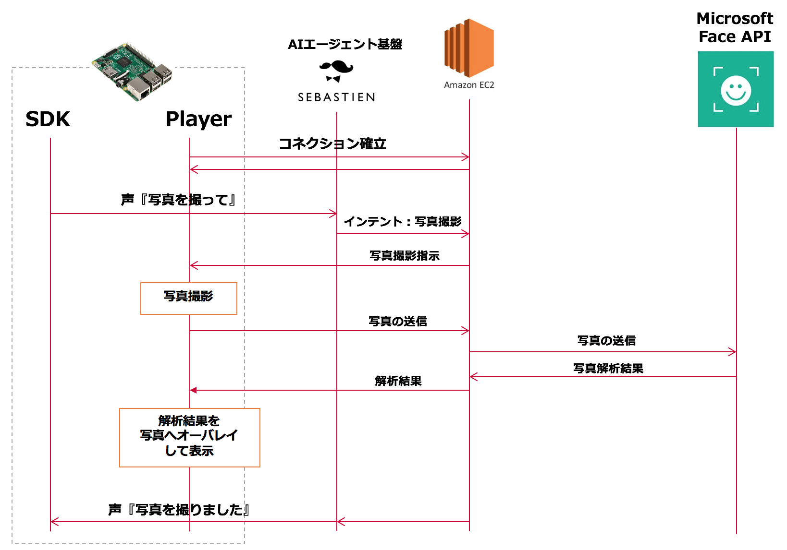

# Sebastien Code Samples
These are sample codes of DOCOMO AI Agent (Sebastien)

## Description
このコードはドコモAIエージェントのエキスパートエージェントのサンプルコードです。エキスパートエージェントをRaspberryPi上に実装し、
さらにclient.pyを走行させることで、server.pyと連携し、下記のデモを実現できます。
1. 写真を撮ってと言われると画像を伝送するデモ(PhotoShooter)
- RaspberryPiで画像を撮影し、Websocketで転送することで、サーバーに画像を伝送します。
- 転送された画像はMicrosoftのFaceAPIによって年齢を推定します。推定結果を音声で返します。
2. インテントに応じて音を鳴らすデモ(Mp3Player)
- RaspberryPi上でMp3を鳴らします。インテントに応じて、予め設定されているMp3を鳴らしたり、サーバ上のMp3ファイルを転送して鳴らすことが出来ます。
3. 好きな音楽を鳴らすデモ(MusicPlayer)
- iTunesから音楽を検索して、RaspberryPi上で鳴らすことが出来るデモです。

## Usage
いずれのコードも2つのコンポーネント(Clientとサーバー)から出来ています。
Websocketベースですので、サーバーが別途必要です。WebSocketなので、サーバーレスには出来ません。

|対象|説明|
|---|---|
|Client|クライアントのソフトウェアです。Raspberry Pi上で動作させます。起動と同時にWebSocketをServerに対して張り、命令を待ちます。|
|Server|サーバー側に配置します。PythonのFlaskベースで記述しています。EC2などのサーバー上に配置して利用下さい。|

## PhotoShooter
### シーケンス図

### 利用上の注意
- サーバーのエンドポイントの設定はハードコートしていますので、適宜変更下さい。
- マイクロソフトのFaceAPIのCredentialはハードコートしていますので、適宜変更下さい。

## Mp3Player
### シーケンス図

### 利用上の注意
- サーバーのエンドポイントの設定はハードコートしていますので、適宜変更下さい。

## MusicPlayer
### シーケンス図

### 利用上の注意
- サーバーのエンドポイントの設定はハードコートしていますので、適宜変更下さい。

## Licence

再配布、改変自由です。

## Author

[akinaga](https://github.com/akinaga)
